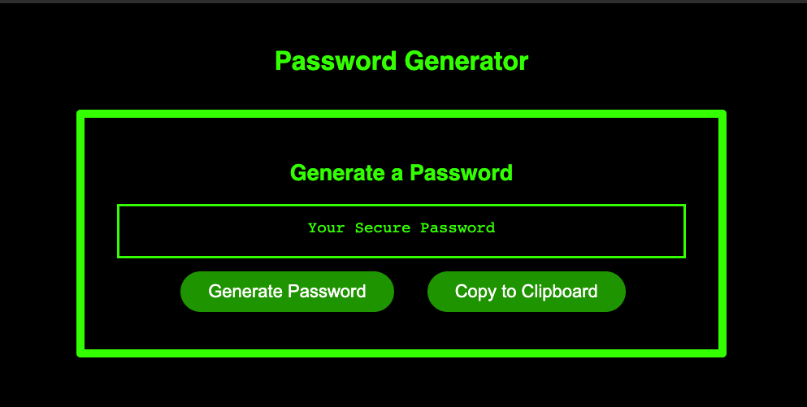

# Super-Password-Generator

## Completed Web Page

The following image shows the completed web application's appearance and functionality:





## Tasks to be Completed for Acceptance

```
GIVEN I need a new, secure password
WHEN I click the button to generate a password
THEN I am presented with a series of prompts for password criteria
WHEN prompted for password criteria
THEN I select which criteria to include in the password
WHEN prompted for the length of the password
THEN I choose a length of at least 8 characters and no more than 128 characters
WHEN prompted for character types to include in the password
THEN I choose lowercase, uppercase, numeric, and/or special characters
WHEN I answer each prompt
THEN my input should be validated and at least one character type should be selected
WHEN all prompts are answered
THEN a password is generated that matches the selected criteria
WHEN the password is generated
THEN the password is either displayed in an alert or written to the page
```

## Steps to complete homework

### In JS
- Created different vars containing the different character types needed
- Created function that prompts the user for the requirements they need
    - prompts user for number of characters (More than 8 and less than 128)
    - prompts for character types
- Created function to randomly generate characters from each array and combine them into a main array based on user's required character types
- Created button functionality for generating password on button click
- Created button functionality for copying generated password on button click


### In HTML
- Added a copy to clipboard button

### In CSS
- Updated look of webpage to look like an old terminal


## Link to Webpage 
[Super Password Generator](https://msas12.github.io/Super-Password-Generator/)